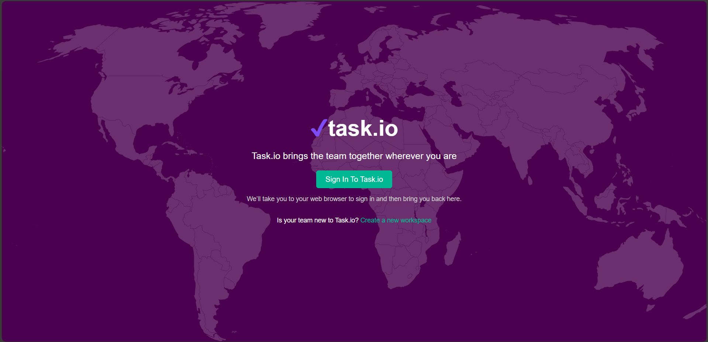
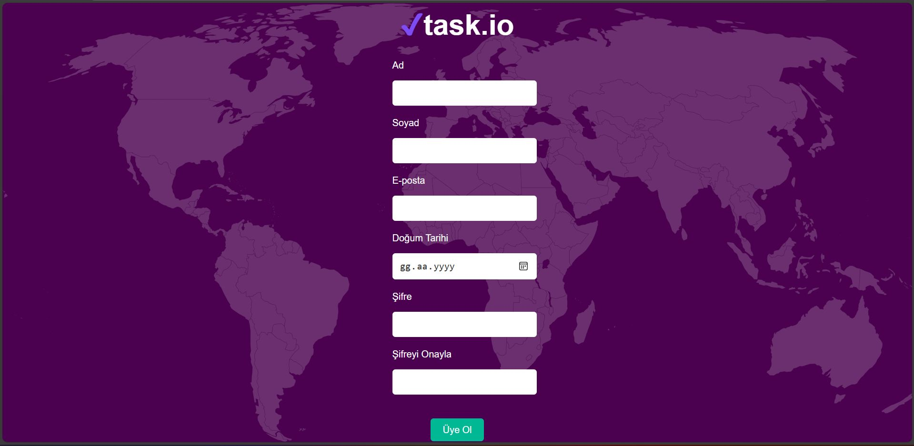
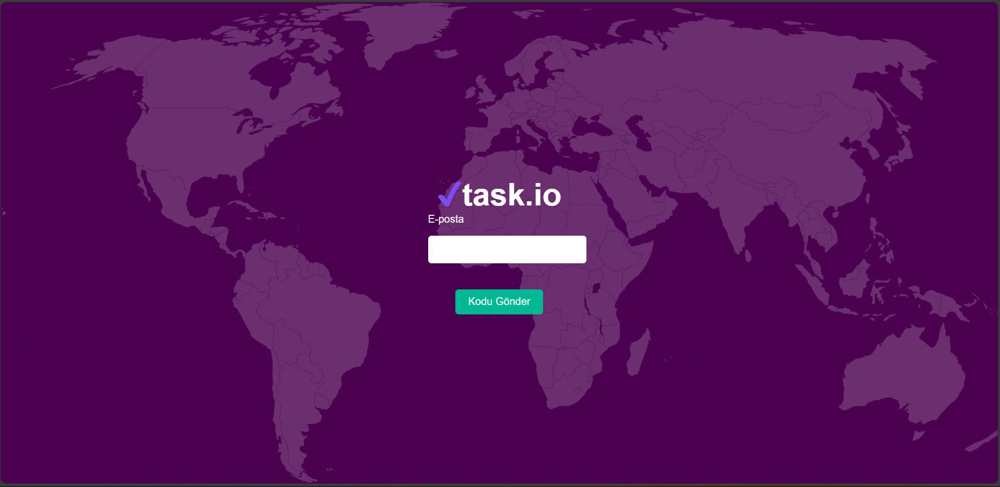

# taskio
Task.io is a web application that controls workflow

(The images below are taken from the task.io login screen.)

The given image shows the task and user login screen. With this screen, taskio registers the user and keeps it in the mongo db database.

